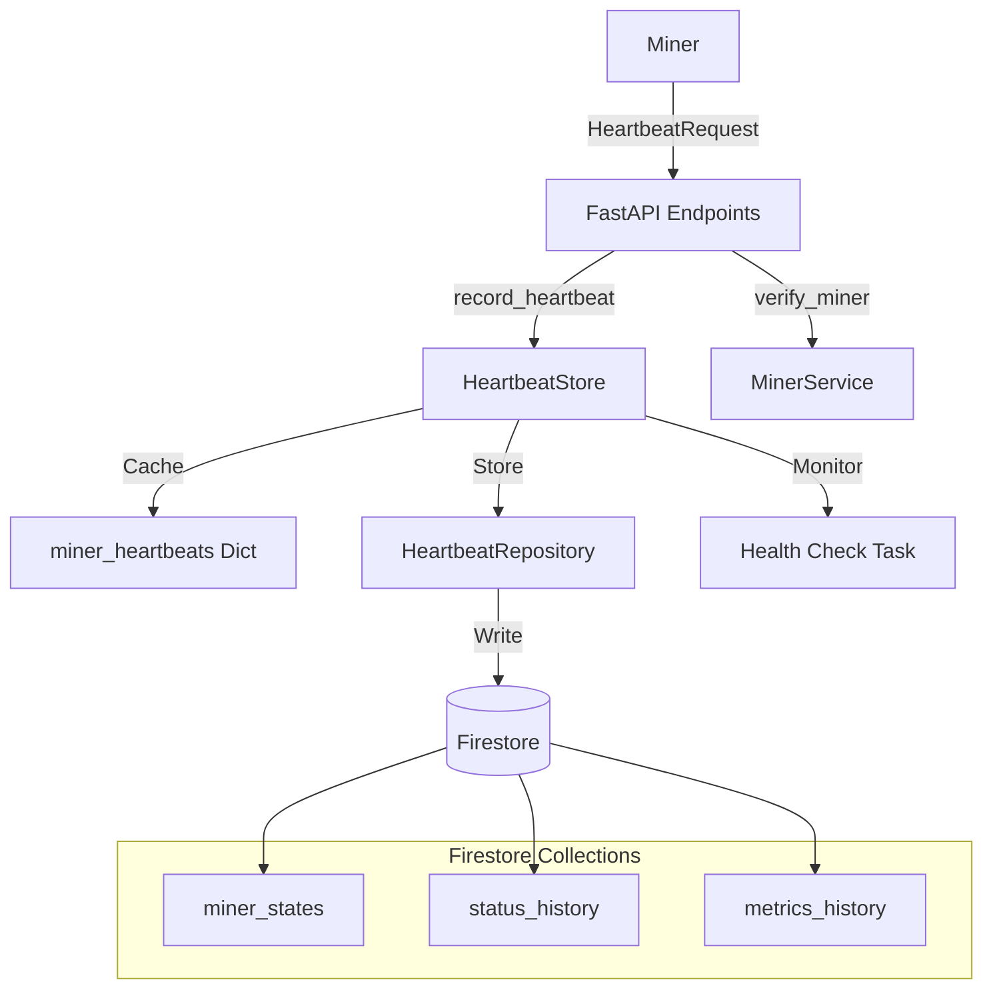
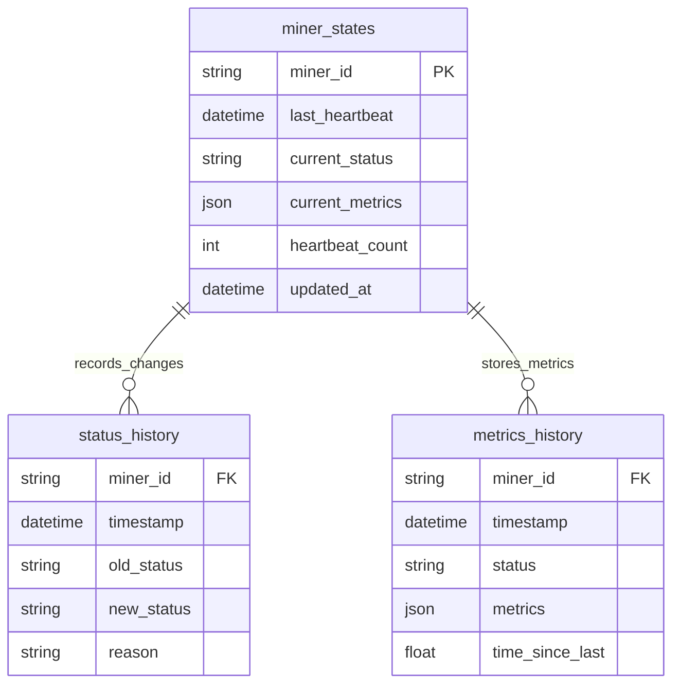

# Polaris CLI Tool

A modern development workspace manager for distributed compute resources. Polaris simplifies managing compute resources, monitoring their status, and automating key tasks in a distributed environment.

---

## Features

- **Register and manage compute resources:** Add and monitor distributed compute nodes.
- **Monitor system status:** View system health and active processes.
- **Manage SSH connections:** Automate and configure secure SSH connections.
- **Automated tunnel setup:** Establish secure tunnels seamlessly.
- **Cross-platform support:** Works on Windows, Linux, and macOS.

---

## Installation and Setup

### 1. Clone the Repository

```bash
# Clone the Polaris repository
git clone https://github.com/bigideainc/polaris-subnet.git
cd polaris-subnet
```

### 2. Create and Activate a Virtual Environment

It's best practice to use a Python virtual environment to isolate dependencies.

#### Create the Virtual Environment

```bash
# Create a virtual environment named 'venv'
python3 -m venv venv
```

*Note:* If your system uses `python` instead of `python3`, adjust the command accordingly:
```bash
python -m venv venv
```

#### Activate the Virtual Environment

- **On macOS/Linux:**
  ```bash
  source venv/bin/activate
  ```
- **On Windows (Command Prompt):**
  ```batch
  venv\Scripts\activate.bat
  ```
- **On Windows (PowerShell):**
  ```powershell
  venv\Scripts\Activate.ps1
  ```

Once activated, your command prompt should indicate the virtual environment is active (e.g., it may start with `(venv)`).

### 3. Install Dependencies

Ensure you have **Python 3.6** or higher installed. With the virtual environment active, install the required dependencies:

```bash
pip install -r requirements.txt
```

Alternatively, you can install Polaris in editable mode:

```bash
pip install -e .
```

### 4. Configure SSH Password

Polaris uses your machine's SSH password for secure connections. Add your SSH password to a `.env` file at the root of the project:

```bash
# .env file
SSH_PASSWORD=your_password_here
```

**Note:** The SSH password is used to configure and manage secure SSH tunnels between your machine and the Polaris compute network.

### 5. Verify Installation

Check that Polaris is installed correctly by running:

```bash
polaris --help
```

You should see output similar to:

```
Usage: polaris [OPTIONS] COMMAND [ARGS]...

Polaris CLI - Modern Development Workspace Manager for Distributed Compute Resources

Options:
  --help  Show this message and exit.

Commands:
  check-main     Check if main process is running and view its logs.
  logs           View logs without process monitoring.
  register       Register a new miner.
  start          Start Polaris and Compute Subnet as background processes.
  status         Check if Polaris and Compute Subnet are running.
  stop           Stop Polaris and Compute Subnet background processes.
  update         Update various Polaris components.
  view-compute   View pod compute resources.
```

---

## Prerequisites

Before running `polaris start`, ensure you have the following prerequisites configured:

### 1. Docker Installed and Running

**Installation:**
- Visit [Docker's official site](https://docs.docker.com/get-docker/) for installation instructions tailored to your operating system.

**Running Docker:**
- **Verify Installation:**
  ```bash
  docker --version
  ```
  **Expected Output:**
  ```
  Docker version 20.10.7, build f0df350
  ```
- **Check Docker Status:**
  ```bash
  docker info
  ```
  **Expected Output:**
  ```
  Client:
   Debug Mode: false

  Server:
   Containers: 5
   Running: 2
   Paused: 0
   Stopped: 3
   ...
  ```
- **Start Docker Manually (if not running):**
  - **Windows/Mac:** Launch Docker Desktop from your applications menu.
  - **Linux:** Start Docker service using your system's service manager, e.g.,
    ```bash
    sudo systemctl start docker
    ```

### 2. ngrok Running

**Installation:**
- Download and install ngrok from [ngrok's website](https://ngrok.com/download).

**Setup and Running a Tunnel:**
- **Basic Tunnel (No Authentication Required):**
  ```bash
  ngrok tcp 22
  ```
  **Sample Output:**
  ```
  Session Status                online
  Account                       Example User (Plan: Free)
  Version                       2.3.40
  Region                        United States (us)
  Web Interface                 http://127.0.0.1:4040
  Forwarding                    tcp://0.tcp.ngrok.io:12345 -> localhost:22
  ```
  - **Explanation:**
    - `Forwarding` provides a public URL (`tcp://0.tcp.ngrok.io:12345`) that tunnels to your local SSH service (`localhost:22`).

### 3. SSH Service Running

**Check SSH Status:**
- **Linux:**
  ```bash
  sudo systemctl status ssh
  ```
  **Expected Output:**
  ```
  ● ssh.service - OpenBSD Secure Shell server
     Loaded: loaded (/lib/systemd/system/ssh.service; enabled; vendor preset: enabled)
     Active: active (running) since Tue 2025-01-07 05:03:14 UTC; 1h 30min ago
     ...
  ```
- **Windows:**
  - **Enable OpenSSH Server:**
    1. Go to **Settings** > **Apps** > **Optional Features**.
    2. Click **Add a feature**.
    3. Find and install **OpenSSH Server**.
  - **Start SSH Service:**
    ```powershell
    Start-Service sshd
    ```
  - **Set SSH to Start Automatically:**
    ```powershell
    Set-Service -Name sshd -StartupType 'Automatic'
    ```

**Start SSH if Needed:**
- **Linux:**
  ```bash
  sudo systemctl start ssh
  ```
- **Windows:**
  ```powershell
  Start-Service sshd
  ```

**Verify SSH Configuration:**
- **Linux:** Check `/etc/ssh/sshd_config` for correct settings.
- **Windows:** Ensure OpenSSH Server is properly configured via **Settings** or configuration files.

### 4. Public IP Address for Your Compute Node

**Objective:**  
Ensure your compute node has a public IP address or is directly accessible from the internet. This allows other nodes and services to connect to your machine without intermediary tunneling solutions.

**Steps to Make Your Compute IP Public:**

#### A. Verify Your Current Public IP

1. **Check Public IP:**
   - Open a terminal on your compute node and run:
     ```bash
     curl ifconfig.me
     ```
     or
     ```bash
     curl ipinfo.io/ip
     ```
   - The returned IP should be a public IP. If it shows a private IP (e.g., 192.168.x.x, 10.x.x.x, or 172.16.x.x to 172.31.x.x), then your machine is behind a NAT and does not have a direct public IP.

#### B. Configuring Public IP Access

If your machine does not have a public IP, follow one of these approaches to expose it:

1. **Direct Public IP from ISP:**
   - **Request a Public IP:** Contact your Internet Service Provider (ISP) to request a static or dynamic public IP assignment for your machine.
   - **Configure Network Interface:** 
     - If given a static IP, configure your network interface with the provided IP, subnet mask, gateway, and DNS settings.
     - On Linux, for example, you might update your network configuration file or use `nmcli`/`ifconfig` depending on your distribution.

2. **Port Forwarding Through a Router:**
   - **Access Router Settings:**
     - Log into your router’s administration panel (usually accessed via a web browser at an address like `192.168.1.1`).
   - **Configure Port Forwarding:**
     1. Locate the port forwarding section.
     2. Add a new port forwarding rule to forward external traffic to your compute node’s internal IP:
        - **External Port:** e.g., 22 for SSH or a custom port as required by Polaris.
        - **Internal IP Address:** The local IP of your compute node.
        - **Internal Port:** The port on which your service is running (e.g., 22 for SSH).
   - **Save and Apply:** Save changes and restart the router if necessary.
   - **Determine Your Public IP:** Find your router's public IP by checking the router status page or using a service like [WhatIsMyIP.com](https://www.whatismyip.com/).

3. **Dynamic DNS (if you have a dynamic public IP):**
   - **Set Up Dynamic DNS:** If your ISP assigns a dynamic public IP, use a Dynamic DNS service (like No-IP, DynDNS, etc.) to associate a domain name with your changing IP.
   - **Configure Your Router or Client:**
     - Many routers support Dynamic DNS configuration directly. Input your Dynamic DNS credentials into the router’s DDNS settings.
     - Alternatively, run a Dynamic DNS client on your compute node to update the DNS record whenever your IP changes.

#### C. Verify Public Accessibility

Once configured, verify that your compute node is accessible from the internet:

- **Test SSH Connection:**
  ```bash
  ssh user@your_public_ip_or_ddns_domain -p <forwarded_port>
  ```
  Replace `your_public_ip_or_ddns_domain` with your public IP or Dynamic DNS domain and `<forwarded_port>` with the forwarded port number (commonly 22 for SSH).

- **Check Port Status:**
  Use an online port checking service like [CanYouSeeMe.org](https://canyouseeme.org/) to confirm the relevant port is open and reachable.

**Security Considerations:**

- **Firewall Rules:**  
  Ensure your firewall (both on the compute node and network level) allows incoming connections on the necessary ports, but also restricts access to trusted IPs when possible.

- **Strong Authentication:**  
  Use strong passwords, SSH keys, or other authentication methods to secure direct access to your compute node.

---

## Usage Guide

### **Start the Polaris Service**

After ensuring all prerequisites are met, start Polaris with:

```bash
polaris start
```

**Example Interaction:**

```
Starting Polaris...
Please select the type of node you want to run:
1. Miner Node
2. Validator Node
Enter choice [1-2]: 1

Starting Miner Node...
polaris started successfully with PID 12345.
compute_subnet started successfully with PID 67890.
Logs: stdout -> logs/polaris_stdout.log, stderr -> logs/polaris_stderr.log
```

*Note:* Selecting "2" for Validator Node will initiate validator-specific services.

---

### **Register a New Miner**

To register as a new miner, run:

```bash
polaris register
```

#### Registration Process:

1. **System Information Check**

   Upon running the registration command, Polaris will load and validate your system's compute resources. You will see detailed information similar to the following:

   ```
   System Information
   ------------------
   Location: Example City, Example Country
   Compute Resources:
     - ID: ABCD1234-EFGH-5678-IJKL-9012MNOP3456
     - Resource Type: CPU
     - RAM: 32GB
     - Storage: SSD, 1TB, Read Speed: 550MB/s, Write Speed: 520MB/s
     - CPU Specs: Example CPU Model, 8 Cores, 3.2GHz
     - Network: Internal IP - 192.168.1.100, SSH - ssh://user@0.tcp.ngrok.io:12345
   ```

2. **User Verification**

   After displaying system information, Polaris will prompt you to verify and proceed with the registration:

   ```
   Do you want to proceed with this registration? [y/n]: y
   ```

3. **Username and Wallet Setup**

   - **Enter Desired Username:**

     ```
     Enter your desired username (): sampleuser
     ```

   - **Commune Wallet Registration Prompt:**

     Before entering your Commune wallet name, ensure that your wallet key is registered under our Polaris subnet on Commune. If you don’t have a registered Commune miner wallet, follow the instructions below to create and register one.

     **Sample Prompt:**

     ```
     ┏━━━━━━━━━━━━━━━━━━━━━━━━━━━━━━ 🔒 Commune Miner Registration ━━━━━━━━━━━━━━━━━━━━━━━━━━━━━━━┓
     ┃                                                                                            ┃
     ┃   You are about to register as a POLARIS COMMUNE MINER                                     ┃
     ┃                                                                                            ┃
     ┃   This will:                                                                               ┃
     ┃   • Connect you to our Polaris Commune Network                                             ┃
     ┃   • Enable you to earn rewards                                                             ┃
     ┃   • Join the decentralized compute ecosystem                                               ┃
     ┃                                                                                            ┃
     ┃   ────────────────────────────────────                                                     ┃
     ┃                                                                                            ┃
     ┃   Requirements:                                                                            ┃
     ┃   • Must have registered Commune key                                                       ┃
     ┃   • Key must be registered under our Polaris subnet on Commune                             ┃
     ┃                                                                                            ┃
     ┃   If you don't have a registered Commune miner wallet, follow instructions below:          ┃
     ┃   • [Commune Keys Documentation](https://communeai.org/docs/working-with-keys/key-basics)    ┃
     ┃   • [Polaris Subnet Registration Instructions](https://github.com/bigideainc/polaris-subnet) ┃
     ┃                                                                                            ┃
     ┃   Please enter your Commune wallet name below                                              ┃
     ┃                                                                                            ┃
     ┃   Note: This wallet must be registered under Polaris miner subnet (NetUID 33) on Commune    ┃
     ┃                                                                                            ┃
     ┗━━━━━━━━━━━━━━━━━━━━━━━━━━━━━━━━━━━━━━━━━━━━━━━━━━━━━━━━━━━━━━━━━━━━━━━━━━━━━━━━━━━━━━━━━━━━┛
     ```

     ```
     Enter your Commune wallet name: sample_wallet
     ```

4. **Creating and Registering Your Commune Wallet for Miner Registration**

   **Step-by-Step Instructions:**

   1. **Install CommuneX:**

      Install the CommuneX package, a tool for interacting with the Commune network:

      ```bash
      pip install communex
      ```

   2. **Create a Wallet (Burns 10 COMAI Tokens):**

      Before creating a new wallet, **ensure that your Commune account has at least 10 COMAI tokens**. This is necessary because creating a wallet will burn 10 COMAI tokens on the Commune network as part of the key creation process.

      Forge a new wallet for your mining ventures:

      ```bash
      comx key create sample_wallet
      ```

      **Sample Output:**

      ```
      Creating new Commune wallet 'sample_wallet'...
      Wallet 'sample_wallet' created successfully.
      Note: 10 COMAI tokens have been burned for wallet creation.
      ```

   3. **Register on Polaris Compute Subnet (NetUID 33) as a Miner:**

      After creating your wallet, register it under the Polaris subnet.

      ```bash
      comx module register miner sample_wallet 33
      ```

      **Sample Output:**

      ```
      Registering wallet 'sample_wallet' on Polaris Compute Subnet (NetUID 33)...
      Verification of COMAI tokens...
      Registration successful.
      Your wallet 'sample_wallet' is now registered under Polaris Compute Subnet.
      ```

5. **Complete Miner Registration:**

   - **Enter Commune Wallet Name:**

     After successfully registering your Commune wallet, return to the Polaris registration process. Enter your Commune wallet name when prompted:

     ```
     Enter your Commune wallet name: sample_wallet
     ```

   - **System Retrieves Commune UID:**

     ```
     Retrieving Commune UID...
     2025-01-07 05:03:14,224 [INFO] Retrieved miner UID: 2 for wallet: sample_wallet
     ```

   - **Registration Confirmation:**

     ```
     Registration Complete
     ---------------------
     Miner ID: MINERID1234567890
     Added Resources: CPU
     Network: Commune
     Wallet Name: sample_wallet
     Commune UID: CID_SAMPLE123

     Important: Save your Miner ID - you'll need it to manage your compute resources.
     ```

6. **Validation Checks:**

   Throughout the registration process, Polaris performs several validation checks to ensure everything is configured correctly:

   - **System Information Format:** Ensures all system details are correctly formatted and complete.
   - **Compute Resource Specifications:** Verifies that your compute resources meet the required specifications.
   - **Network Connectivity:** Confirms that your machine is properly connected to the Polaris network via ngrok and SSH.
   - **SSH Configuration:** Checks that SSH is correctly configured and accessible.
   - **User Inputs:** Validates the accuracy and format of the entered username and Commune wallet name.

   **Sample Validation Output:**

   ```
   Running validation checks...
   ✔ System Information: Valid
   ✔ Compute Resources: Sufficient specifications
   ✔ Network Connectivity: Connected via ngrok
   ✔ SSH Configuration: Active and accessible
   ✔ User Inputs: Username and wallet name validated
   All validation checks passed successfully.
   ```

---

### **View Compute Resources**

List all registered compute resources in a formatted table:

```bash
polaris view-compute
```

**Example Output:**

```
Pod Details
-----------
ID: MINERID1234567890
Name: Polaris Compute Pod
Location: Example City, Example Country
Description: Distributed compute node

Compute Resources
-----------------
ID           Type  Location             Price/Hr  RAM    Storage      Specs
------------ ----- -------------------- --------- ------ ----------- ----------------------------------
CPU123456    CPU   Example City, Country $0.10/hr  32GB   SSD 1TB     8 Cores, 3.2GHz
GPU789012    GPU   Example City, Country $0.20/hr  16GB   SSD 512GB   NVIDIA Tesla V100, 5000 CUDA Cores
```

---

### **Check Service Status**

Verify if Polaris and Compute Subnet processes are running:

```bash
polaris status
```

**Example Output:**

```
polaris is running with PID 12345.
compute_subnet is running with PID 67890.
```

---

### **Stop the Polaris Service**

Stop Polaris and Compute Subnet:

```bash
polaris stop
```

**Example Output:**

```
Stopping Polaris...
polaris stopped successfully.
Stopping Compute Subnet...
compute_subnet stopped successfully.
```

---

### **View Logs**

Access Polaris logs without monitoring processes:

```bash
polaris logs
```

**Example Output:**

```
[INFO] 2025-01-07 05:00:00: Polaris service started.
[INFO] 2025-01-07 05:05:00: New miner registered with ID MINERID1234567890.
```

---

### **Update Subnet Repository**

Update the Polaris subnet repository to the latest version:

```bash
polaris update subnet
```

**Example Output:**

```
Updating Polaris Subnet Repository...
Update completed successfully.
```

---

### **Check Main Process Logs**

Check if the main process is running and view its logs:

```bash
polaris check-main
```

**Example Output:**

```
Main process is running with PID 12345.
Logs: logs/main_stdout.log, logs/main_stderr.log
```

---

## Technical Documentation

### System Architecture Overview



### Core Components

#### HeartbeatStore

Manages in-memory state tracking of miner heartbeats and orchestrates periodic health checks:

```python
class HeartbeatStore:
    def __init__(self):
        self.miner_heartbeats: Dict[str, datetime] = {}
        self.repository = HeartbeatRepository()
        self.offline_threshold = timedelta(seconds=45)
        self.health_check_task = None
        self._alert_sent: Dict[str, bool] = {}
```

#### Database Schema



For complete technical documentation, including API endpoints, data models, error handling, and more, please refer to the [Technical Documentation](./docs/technical.md).

---

## Requirements

- **Python:** Version 3.6 or higher.
- **Operating Systems:** Compatible with Windows, Linux, and macOS.
- **Docker:** Installed and running.
- **ngrok:** Installed and running to create secure tunnels.
- **SSH Service:** Active and properly configured on your machine.
- **Public IP:** Your compute node should be publicly accessible, either via a direct public IP or properly configured port forwarding.

---

## Author

**Polaris Team**  
Hit us up on Discord: [compute-33](https://discord.com/channels/941362322000203776/1324582017513422870)

---

*For further assistance or inquiries, please reach out to the Polaris Team.*
```
