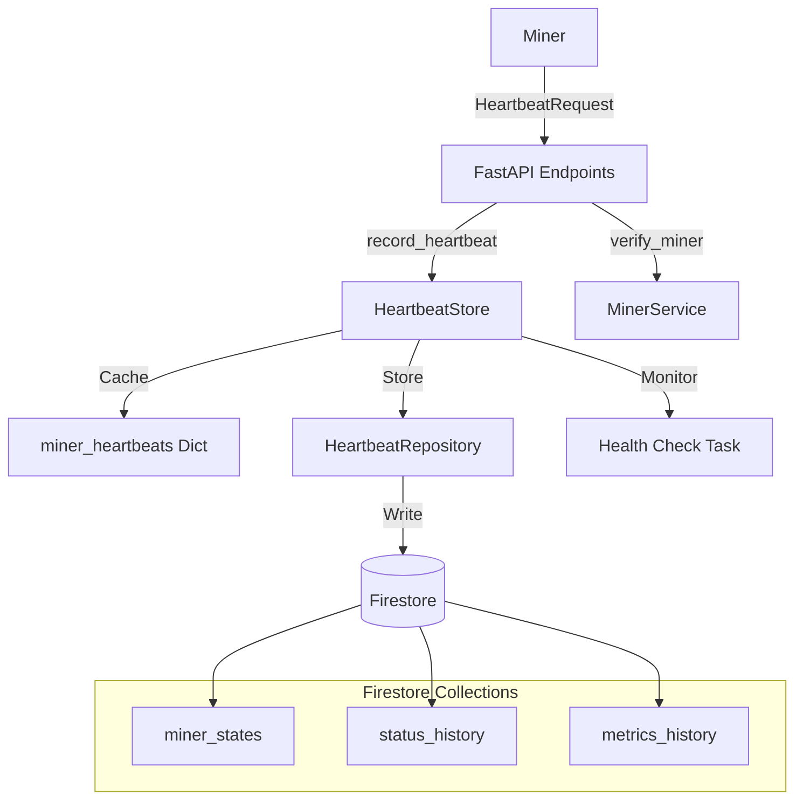
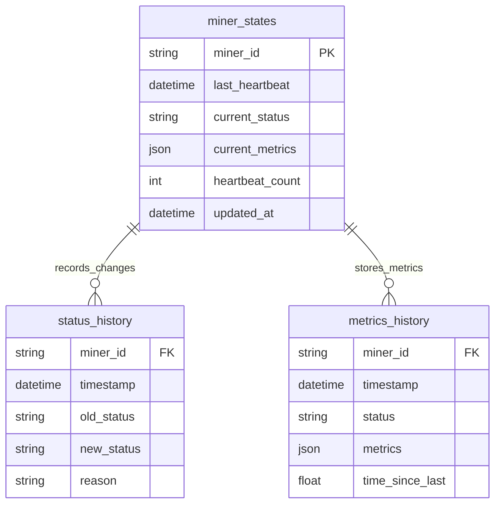

# Polaris Subnet Docs

A modern development workspace manager for distributed compute resources. Polaris simplifies managing compute resources, monitoring their status, and automating key tasks in a distributed environment.

---

## Features

- **Register and manage compute resources:** Add and monitor distributed compute nodes.
- **Monitor system status:** View system health and active processes.
- **Manage SSH connections:** Automate and configure secure SSH connections.
- **Automated tunnel setup:** Establish secure tunnels seamlessly.
- **Cross-platform support:** Works on Windows, Linux, and macOS.

---

## Installation and Setup

### 1. Clone the Repository

```bash
# Clone the Polaris repository
git clone https://github.com/bigideainc/polaris-subnet.git
cd polaris-subnet
```

### 2. Install Dependencies

Ensure you have **Python 3.6** or higher installed. Then, install the required dependencies:

```bash
pip install -r requirements.txt
```

Install Polaris in editable mode:

```bash
pip install -e .
```

### 3. Configure SSH Password

Polaris uses your machine's SSH password for secure connections. Add your SSH password to a `.env` file at the root of the project:

```bash
# .env file
SSH_PASSWORD=your_password_here
```

**Note:** The SSH password is used to configure and manage secure SSH tunnels between your machine and the Polaris compute network.

### 4. Verify Installation

Check that Polaris is installed correctly by running:

```bash
polaris --help
```

You should see the following output:

```
Usage: polaris [OPTIONS] COMMAND [ARGS]...

Polaris CLI - Modern Development Workspace Manager for Distributed Compute Resources

Options:
  --help  Show this message and exit.

Commands:
  check-main     Check if main process is running and view its logs.
  logs           View logs without process monitoring.
  register       Register a new miner.
  start          Start Polaris and Compute Subnet as background processes.
  status         Check if Polaris and Compute Subnet are running.
  stop           Stop Polaris and Compute Subnet background processes.
  update         Update various Polaris components.
  view-compute   View pod compute resources.
```

---

## Usage Guide

Below are detailed instructions and example outputs for each command supported by Polaris.

### **Start the Polaris Service**

Start Polaris and its associated Compute Subnet:

```bash
polaris start
```

**Example Output:**

```
Starting Polaris...
polaris started successfully with PID 11234.
compute_subnet started successfully with PID 56789.
Logs: stdout -> logs/polaris_stdout.log, stderr -> logs/polaris_stderr.log
```

---

### **Register a New Miner**

Register a miner to manage compute resources. The registration process includes several key steps and network options:

```bash
polaris register
```

**Registration Process:**

1. **System Information Check**
   - Automatically loads and validates your system's compute resources
   - Displays detailed information including:
     - Location
     - Resource IDs
     - RAM configurations
     - Storage details (type, capacity, read/write speeds)
     - CPU specifications
     - Network configuration

2. **Network Selection**
   You can choose between different network types:
   - **Bittensor Network**: For distributed AI training
   - **Commune Network**: For decentralized compute resources
   - **Standard Registration**: Default compute network

3. **Registration Options**
   - **Username**: Set your desired username for the network
   - **Network-Specific Settings**:
     - For Bittensor: Additional blockchain configurations
     - For Commune: Wallet name and UID setup
   - **SSH Configuration**: Automatic setup of secure connections

**Example Interaction:**

```
System Information
------------------
location: Nairobi, Kenya
compute_resources[0].id: 123e4567-e89b-12d3-a456-426614174000
compute_resources[0].ram: 32GB
compute_resources[0].storage.type: SSD
compute_resources[0].storage.capacity: 1TB
compute_resources[0].cpu_specs.cpu_name: Intel Xeon
compute_resources[0].network.internal_ip: 192.168.1.100

Do you want to proceed with this registration? [y/n]: y

Select Network Type:
1. Bittensor Network
2. Commune Network
3. Standard Registration
Enter choice [1-3]: 2

Enter your desired username: user123

Commune Network Setup:
- Creating wallet...
- Generating UID...
- Configuring network settings...

Registration Complete
---------------------
Miner ID: MXN12345abcdef67890
Added Resources: CPU, GPU
Network: Commune
Wallet Name: commune_wallet_123
Commune UID: CID_987654321

Important: Save your Miner ID - you'll need it to manage your compute resources.
```

**Validation Checks:**
- Validates system information format
- Verifies compute resource specifications
- Confirms network connectivity
- Ensures SSH configuration is correct
- Validates RAM format and storage configurations

---

### **View Compute Resources**

List all registered compute resources in a formatted table:

```bash
polaris view-compute
```

**Example Output:**

```
Pod Details
-----------
ID: MXN12345abcdef67890
Name: Polaris Compute Pod
Location: Nairobi, Kenya
Description: Distributed compute node

Compute Resources
-----------------
ID         Type  Location       Price/Hr  RAM    Storage      Specs
---------- ----- -------------- --------- ------ ----------- ----------------------------------
321abc     CPU   Nairobi, Kenya $0.10/hr  32GB   SSD 1TB     16 Cores, 3.8GHz
654xyz     GPU   Nairobi, Kenya $0.20/hr  16GB   SSD 512GB   NVIDIA Tesla V100, 5000 CUDA Cores
```

---

### **Check Service Status**

Verify if Polaris and Compute Subnet processes are running:

```bash
polaris status
```

**Example Output:**

```
polaris is running with PID 11234.
compute_subnet is running with PID 56789.
```

---

### **Stop the Polaris Service**

Stop Polaris and Compute Subnet:

```bash
polaris stop
```

**Example Output:**

```
Stopping Polaris...
polaris stopped successfully.
Stopping Compute Subnet...
compute_subnet stopped successfully.
```

---

### **View Logs**

Access Polaris logs without monitoring processes:

```bash
polaris logs
```

**Example Output:**

```
[INFO] 2024-12-31 10:00:00: Polaris service started.
[INFO] 2024-12-31 10:05:00: New miner registered with ID MXN12345abcdef67890.
```

---

### **Update Subnet Repository**

Update the Polaris subnet repository to the latest version:

```bash
polaris update subnet
```

**Example Output:**

```
Updating Polaris Subnet Repository...
Update completed successfully.
```

---

### **Check Main Process Logs**

Check if the main process is running and view its logs:

```bash
polaris check-main
```

**Example Output:**

```
Main process is running with PID 11234.
Logs: logs/main_stdout.log, logs/main_stderr.log
```

---

## Technical Documentation

### System Architecture Overview



### Core Components

#### HeartbeatStore
Manages in-memory state tracking of miner heartbeats and orchestrates periodic health checks:

```python
class HeartbeatStore:
    def __init__(self):
        self.miner_heartbeats: Dict[str, datetime] = {}
        self.repository = HeartbeatRepository()
        self.offline_threshold = timedelta(seconds=45)
        self.health_check_task = None
        self._alert_sent: Dict[str, bool] = {}
```

#### Database Schema



For complete technical documentation, including API endpoints, data models, error handling, and more, please refer to the [Technical Documentation](./docs/technical.md).

---

## Requirements

- **Python:** Version 3.6 or higher.
- **Operating Systems:** Compatible with Windows, Linux, and macOS.

---

## Author

**Polaris Team**  
Commune Discord : Channel 33

---

*For further assistance or inquiries, please reach out to the Polaris Team.*
