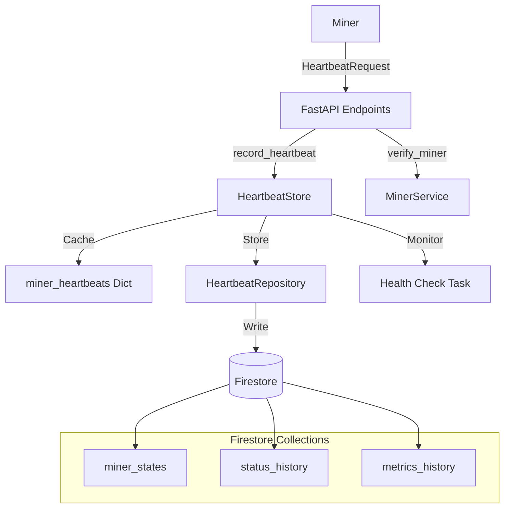
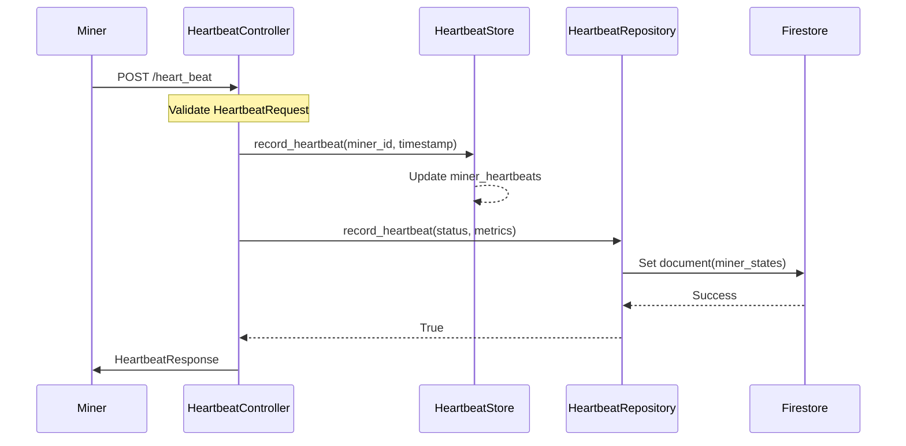
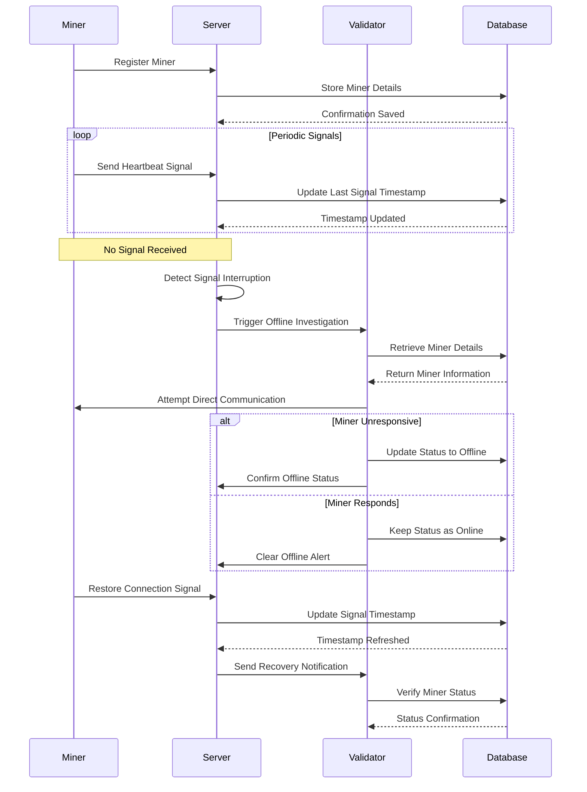
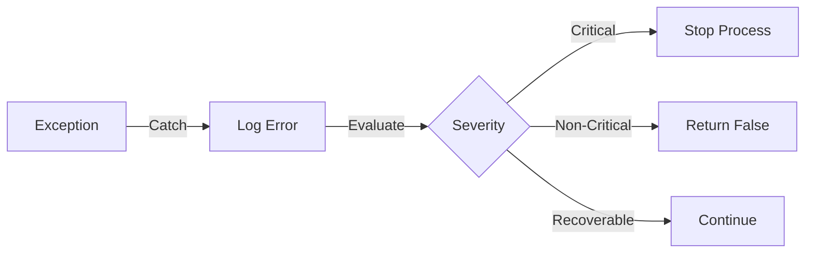
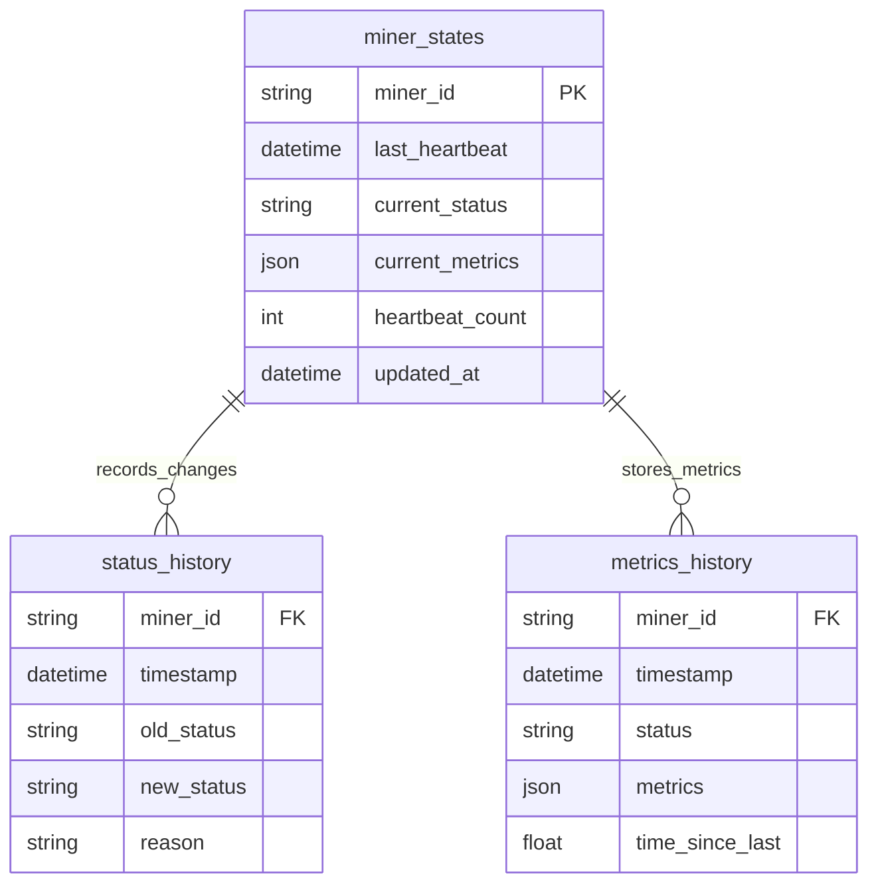

# Technical Documentation: Heartbeat Monitoring System

## Table of Contents
- [Technical Documentation: Heartbeat Monitoring System](#technical-documentation-heartbeat-monitoring-system)
  - [Table of Contents](#table-of-contents)
  - [Introduction](#introduction)
  - [System Architecture Overview](#system-architecture-overview)
  - [Core Components](#core-components)
    - [Heartbeat Signal Lifecycle](#heartbeat-signal-lifecycle)
    - [1. HeartbeatStore Initialization and State Management](#1-heartbeatstore-initialization-and-state-management)
    - [2. Health Check Implementation](#2-health-check-implementation)
    - [3. Heartbeat Recording and Database Operations](#3-heartbeat-recording-and-database-operations)
    - [4. Status Change Recording](#4-status-change-recording)
    - [5. Historical Data Cleanup](#5-historical-data-cleanup)
    - [6. Heartbeat API Endpoint Handler](#6-heartbeat-api-endpoint-handler)
    - [7. Critical Data Structures](#7-critical-data-structures)
  - [Component Interactions](#component-interactions)
  - [Error Handling and Logging](#error-handling-and-logging)
    - [Error Flow](#error-flow)
  - [Database Schema](#database-schema)
    - [Error Handling Strategies](#error-handling-strategies)
    - [Logging Levels](#logging-levels)
  - [Concurrency and Asynchronous Operations](#concurrency-and-asynchronous-operations)
    - [Background Tasks](#background-tasks)
    - [Task Management](#task-management)
  - [Data Models](#data-models)
    - [MinerHeartbeatStatus](#minerheartbeatstatus)
    - [SystemMetrics](#systemmetrics)
    - [HeartbeatRequest](#heartbeatrequest)
    - [HeartbeatResponse](#heartbeatresponse)
  - [Database Operations](#database-operations)
    - [Firestore Collections](#firestore-collections)
    - [Query Operations](#query-operations)
    - [Batch Operations](#batch-operations)
  - [API Endpoints](#api-endpoints)
    - [`/heart_beat` (POST)](#heart_beat-post)
    - [`/miners/heartbeat_status` (GET)](#minersheartbeat_status-get)
  - [Application Lifecycle](#application-lifecycle)
    - [Startup](#startup)
    - [Shutdown](#shutdown)
    - [Running the Application](#running-the-application)
    - [Log Management](#log-management)
    - [Process Management](#process-management)

---

## Introduction

The **Heartbeat Monitoring System** is designed to oversee the operational status of a fleet of miners within a compute subnet. By receiving periodic heartbeat signals from each miner, the system ensures real-time monitoring, detects anomalies, and maintains historical records for analysis and auditing purposes. This document delves into the technical intricacies of the system, elucidating how each component functions individually and in concert with others to deliver a robust monitoring solution.

## System Architecture Overview



At a high level, the Heartbeat Monitoring System comprises the following key components:

1. **API Layer**: Exposes endpoints for miners to send heartbeat signals and for administrators to query miner statuses.
2. **HeartbeatStore**: Manages in-memory state tracking of miner heartbeats and orchestrates periodic health checks.
3. **HeartbeatRepository**: Interfaces with Firestore to persist heartbeat data, status changes, and historical metrics.
4. **HeartbeatService**: Processes incoming heartbeats, determines miner statuses, and handles investigations for offline miners.
5. **Data Models**: Defines the structure of heartbeat requests, responses, and associated metrics using Pydantic models.
6. **Main Application**: Initializes the FastAPI application, configures middleware, and manages startup and shutdown events.

The interplay between these components ensures efficient tracking, timely detection of offline miners, and seamless data persistence.



## Core Components

### Heartbeat Signal Lifecycle



### 1. HeartbeatStore Initialization and State Management

```python
class HeartbeatStore:
    def __init__(self):
        self.miner_heartbeats: Dict[str, datetime] = {}
        self.repository = HeartbeatRepository()
        self.offline_threshold = timedelta(seconds=45)
        self.health_check_task = None
        self._alert_sent: Dict[str, bool] = {}
```

**Detailed Explanation:**

- **Class Definition**: `HeartbeatStore` is responsible for maintaining the in-memory state of miner heartbeats and managing background health checks.

**Initialization (`__init__` method)**:
- `self.miner_heartbeats`: A dictionary mapping each miner's unique identifier (`miner_id`) to the timestamp of their last received heartbeat. This serves as the primary in-memory state tracker.
- `self.repository`: An instance of `HeartbeatRepository`, which handles all interactions with the Firestore database. This separation adheres to the repository pattern, promoting modularity and testability.
- `self.offline_threshold`: A `timedelta` object set to 45 seconds. If a miner's last heartbeat exceeds this threshold, the system will consider the miner offline.
- `self.health_check_task`: Initially set to `None`. This will hold a reference to the asynchronous background task responsible for periodic health checks.
- `self._alert_sent`: A dictionary tracking whether an alert has already been sent for a particular miner being offline. This prevents duplicate alerts for the same offline event.

**Interactions and Responsibilities:**

- The `HeartbeatStore` maintains real-time tracking of miner statuses in memory, allowing for quick access and minimal latency in status evaluations.
- It leverages `HeartbeatRepository` to persist state changes and historical data, ensuring data durability and enabling retrospective analyses.
- The `offline_threshold` determines the sensitivity of the system in detecting offline miners, balancing between timely alerts and avoiding false positives due to transient network issues.
- The `health_check_task` ensures that the system continuously monitors miner statuses without blocking the main execution flow.
- The `_alert_sent` dictionary ensures that administrators are notified only once per offline event, enhancing alert management efficiency.

### 2. Health Check Implementation

```python
async def periodic_health_check(self):
    while True:
        try:
            current_time = datetime.now(timezone.utc)
            offline_miners = []

            for miner_id, last_heartbeat in list(self.miner_heartbeats.items()):
                time_since_last = current_time - last_heartbeat
                logger.debug(f"Miner {miner_id} last heartbeat: {time_since_last.total_seconds()}s ago")
                
                if time_since_last > self.offline_threshold:
                    offline_miners.append(miner_id)
                    self._alert_offline_miner(miner_id, last_heartbeat, time_since_last)

            # Process offline miners
            for miner_id in offline_miners:
                await self.repository.record_heartbeat(
                    miner_id=miner_id,
                    status=MinerHeartbeatStatus.OFFLINE,
                    metrics=None,
                    timestamp=current_time
                )

            await asyncio.sleep(10)
```

**Detailed Explanation:**

- **Function Definition**: `periodic_health_check` is an asynchronous method responsible for continuously monitoring the health of all tracked miners.

- **Infinite Loop (`while True`)**: Ensures that the health check runs indefinitely at specified intervals.

- **Try-Except Block**: Encapsulates the monitoring logic to gracefully handle any unexpected exceptions without terminating the health check loop.

- **Current Time Retrieval**:
    - `current_time`: Captures the current UTC timestamp to ensure consistency across distributed systems and avoid timezone discrepancies.

- **Offline Miners List**:
    - `offline_miners`: An initially empty list to accumulate `miner_id`s that are determined to be offline during the current iteration.

- **Iterating Over Miners**:
    - `for miner_id, last_heartbeat in list(self.miner_heartbeats.items())`: Iterates over a snapshot of the current miner heartbeats. Wrapping the items in `list()` prevents issues if the dictionary is modified during iteration.
    - `time_since_last`: Calculates the duration since the last heartbeat by subtracting `last_heartbeat` from `current_time`.
    - `logger.debug(...)`: Logs the time since the last heartbeat for each miner at the DEBUG level, aiding in troubleshooting and performance monitoring.
    - **Offline Detection**:
        - If `time_since_last` exceeds `self.offline_threshold` (45 seconds), the miner is considered offline.
        - The `miner_id` is appended to the `offline_miners` list.
        - The `_alert_offline_miner` method is invoked to notify administrators about the offline status, ensuring that alerts are managed appropriately.

- **Processing Offline Miners**:
    - For each `miner_id` in `offline_miners`, the system records the offline status in the database by invoking `self.repository.record_heartbeat(...)` with `status` set to `MinerHeartbeatStatus.OFFLINE` and `metrics` as `None`.
    - This operation ensures that the offline status is persisted for future reference and analysis.

- **Sleep Interval**:
    - `await asyncio.sleep(10)`: Suspends the loop for 10 seconds before the next health check iteration. This interval balances responsiveness with resource utilization, ensuring timely detection without excessive CPU usage.

**Key Technical Aspects:**

- **Use of `list()` for Safe Iteration**: By converting `self.miner_heartbeats.items()` to a list, the system avoids runtime errors that could arise from modifying the dictionary while iterating over it.
  
- **UTC Timestamps for Consistency**: Utilizing UTC ensures that time comparisons remain accurate regardless of the server's local timezone, crucial for distributed deployments.

- **Separation of Concerns**: The health check loop focuses solely on detecting offline miners, delegating the alerting and database recording responsibilities to other methods (`_alert_offline_miner` and `record_heartbeat`), enhancing code modularity.

- **Optimized Sleep Interval**: A 10-second sleep interval is chosen to reduce CPU load while maintaining a high level of responsiveness in detecting miner status changes.

### 3. Heartbeat Recording and Database Operations

```python
async def record_heartbeat(
    self,
    miner_id: str,
    status: MinerHeartbeatStatus,
    metrics: Optional[HeartbeatMetrics],
    timestamp: datetime
) -> bool:
    try:
        state_doc = self.miner_states.document(miner_id)
        current_state = state_doc.get()

        state_data = {
            "miner_id": miner_id,
            "last_heartbeat": timestamp,
            "current_status": status.value,
            "heartbeat_count": firestore.Increment(1),
            "updated_at": timestamp
        }

        if metrics is not None:
            state_data["current_metrics"] = metrics.model_dump()

        state_doc.set(state_data, merge=True)
        return True

    except Exception as e:
        logger.error(f"Error recording heartbeat: {e}", exc_info=True)
        return False
```

**Detailed Explanation:**

- **Function Definition**: `record_heartbeat` is an asynchronous method within the `HeartbeatRepository` class that records a miner's heartbeat status and associated metrics into Firestore.

- **Parameters**:
    - `miner_id`: The unique identifier of the miner.
    - `status`: The current status of the miner, represented by the `MinerHeartbeatStatus` enum (`ONLINE`, `OFFLINE`, `DEGRADED`).
    - `metrics`: An optional `HeartbeatMetrics` object containing detailed system metrics. It's `None` when the miner is offline.
    - `timestamp`: The exact time when the heartbeat was received.

- **Try-Except Block**: Ensures that any exceptions during the database operation are caught and logged, preventing system crashes and aiding in debugging.

- **Firestore Document Retrieval**:
    - `state_doc = self.miner_states.document(miner_id)`: Accesses the Firestore document corresponding to the `miner_id` within the `miner_states` collection.
    - `current_state = state_doc.get()`: Retrieves the current state of the miner from Firestore.

- **State Data Preparation**:
    - Creates a dictionary containing the updated state information including:
        - Miner ID
        - Last heartbeat timestamp
        - Current status
        - Heartbeat count (incremented atomically)
        - Update timestamp
        - Optional metrics data

- **Database Update**:
    - `state_doc.set(state_data, merge=True)`: Updates the Firestore document, preserving existing fields not included in the update.

**Technical Implementation:**

- **Atomic Operations**: Uses `firestore.Increment(1)` for atomic counter updates
- **Conditional Logic**: Only includes metrics when available
- **Error Handling**: Logs exceptions with full context
- **Merge Operations**: Preserves existing document data during updates

### 4. Status Change Recording

```python
async def record_status_change(
    self,
    miner_id: str,
    old_status: str,
    new_status: str,
    reason: str
) -> bool:
    try:
        doc = self.status_history.document()
        status_data = {
            "miner_id": miner_id,
            "timestamp": datetime.utcnow(),
            "old_status": old_status,
            "new_status": new_status,
            "reason": reason
        }
        doc.set(status_data)
        return True
    except Exception as e:
        logger.error(f"Error recording status change: {e}", exc_info=True)
        return False
```

**Key Features:**

- Records status transitions with timestamps
- Maintains audit trail of status changes
- Includes reasoning for status transitions
- Uses auto-generated document IDs for chronological ordering
- Implements error handling with logging

### 5. Historical Data Cleanup

```python
async def cleanup_old_heartbeats(self, days_old: int = 30) -> bool:
    try:
        cleanup_threshold = datetime.utcnow() - timedelta(days=days_old)
        
        metrics_query = self.metrics_history.where(
            filter=FieldFilter("timestamp", "<", cleanup_threshold)
        ).stream()

        batch_size = 0
        batch = self.db.batch()

        for doc in metrics_query:
            batch.delete(doc.reference)
            batch_size += 1

            if batch_size >= 500:  # Firestore batch limit
                batch.commit()
                batch = self.db.batch()
                batch_size = 0

        if batch_size > 0:
            batch.commit()

        return True

    except Exception as e:
        logger.error(f"Error cleaning up data: {e}", exc_info=True)
        return False
```

**Implementation Details:**

- **Parameters**: 
    - `days_old`: Retention period in days (default: 30)

- **Core Operations**:
    - Calculates cleanup threshold date
    - Queries metrics older than threshold
    - Deletes records in batches of 500 (Firestore limit)
    - Handles remaining records in final batch

- **Error Handling**:
    - Logs exceptions with stack traces
    - Returns boolean success indicator

### 6. Heartbeat API Endpoint Handler

```python
@router.post("/heart_beat", response_model=HeartbeatResponse)
async def receive_heartbeat(
    heartbeat: HeartbeatRequest,
    background_tasks: BackgroundTasks,
    miner_service: MinerService = Depends(get_miner_service),
) -> HeartbeatResponse:
    try:
        miner_id = heartbeat.metrics.miner_id
        timestamp = datetime.now(timezone.utc)
        
        logger.debug(f"Received heartbeat from miner {miner_id}")
        
        miner = await miner_service.get_miner(miner_id)
        if not miner:
            logger.warning(f"Miner {miner_id} not found")
            raise HTTPException(
                status_code=status.HTTP_404_NOT_FOUND,
                detail=f"Miner {miner_id} not found"
            )

        await heartbeat_store.record_heartbeat(miner_id, timestamp)
        
        success = await heartbeat_store.repository.record_heartbeat(
            miner_id=miner_id,
            status=heartbeat.status,
            metrics=heartbeat.metrics,
            timestamp=timestamp
        )

        if not success:
            raise HTTPException(
                status_code=status.HTTP_500_INTERNAL_SERVER_ERROR,
                detail="Failed to record heartbeat"
            )

        return HeartbeatResponse(
            status="success",
            message="Heartbeat processed successfully",
            last_seen=timestamp,
            commands=[]
        )

    except HTTPException:
        raise
    except Exception as e:
        logger.error(f"Error processing heartbeat: {e}", exc_info=True)
        raise HTTPException(
            status_code=status.HTTP_500_INTERNAL_SERVER_ERROR,
            detail=str(e)
        )
```

**Key Features:**

- **Endpoint Configuration**: 
    - POST route with response model validation
    - Dependency injection for services
    - Background task support

- **Processing Flow**:
    1. Extracts miner ID and timestamps request
    2. Verifies miner existence
    3. Records heartbeat in memory store
    4. Persists data to database
    5. Returns success response

- **Error Handling**:
    - 404 for unknown miners
    - 500 for processing failures
    - Detailed error logging

### 7. Critical Data Structures

```python
class HeartbeatMetrics(BaseModel):
    miner_id: str = Field(..., description="Unique identifier of the miner")
    system_info: SystemInfo = Field(..., description="Static system information")
    metrics: SystemMetrics = Field(..., description="Current system metrics")
    resource_usage: Dict[str, Any] = Field(
        default_factory=dict,
        description="Resource-specific usage details"
    )
    active_jobs: Optional[List[str]] = Field(
        default_factory=list,
        description="List of currently running job IDs"
    )
```

**Fields Description:**

- `miner_id`: Unique identifier for the miner
- `system_info`: Static system data (hostname, IP, OS version)
- `metrics`: Dynamic system performance metrics
- `resource_usage`: Extensible resource-specific details
- `active_jobs`: Currently running job identifiers

## Component Interactions

1. **API Layer → HeartbeatStore**:
    - Processes incoming heartbeats
    - Updates in-memory cache
    - Persists data to Firestore

2. **HeartbeatStore → HeartbeatRepository**:
    - Maintains real-time miner states
    - Triggers periodic health checks
    - Manages state persistence

3. **HeartbeatRepository → Firestore**:
    - Handles database operations
    - Manages data persistence
    - Maintains historical records

## Error Handling and Logging

### Error Flow



## Database Schema



### Error Handling Strategies

1. **Try-Except Blocks**:
    ```python
    try:
        state_doc.set(state_data, merge=True)
        return True
    except Exception as e:
        logger.error(f"Error recording heartbeat: {e}", exc_info=True)
        return False
    ```

2. **HTTP Responses**:
    ```python
    raise HTTPException(
        status_code=status.HTTP_404_NOT_FOUND,
        detail=f"Miner {miner_id} not found"
    )
    ```

### Logging Levels

```python
logger.debug(f"Miner {miner_id} last heartbeat: {time_since_last.total_seconds()}s ago")
logger.error(f"Error recording heartbeat: {e}", exc_info=True)
logger.warning(f"Miner {miner_id} not found")
```

- **DEBUG**: Detailed diagnostic information
- **INFO**: General operational messages
- **WARNING**: Potential issues
- **ERROR**: Serious problems

## Concurrency and Asynchronous Operations

### Background Tasks

```python
async def periodic_health_check(self):
    while True:
        try:
            current_time = datetime.now(timezone.utc)
            offline_miners = []
            
            for miner_id, last_heartbeat in list(self.miner_heartbeats.items()):
                time_since_last = current_time - last_heartbeat
                if time_since_last > self.offline_threshold:
                    offline_miners.append(miner_id)
            
            await asyncio.sleep(10)
        except Exception as e:
            logger.error(f"Health check error: {e}", exc_info=True)
```

### Task Management

```python
@app.on_event("startup")
async def on_startup():
    await heartbeat_store.start()

@app.on_event("shutdown") 
async def on_shutdown():
    await heartbeat_store.stop()
```

**Key Features:**

- Asynchronous endpoint handlers
- Non-blocking I/O operations
- Background health checks
- Graceful startup/shutdown
- Task cancellation handling

## Data Models

### MinerHeartbeatStatus

```python
class MinerHeartbeatStatus(str, Enum):
    ONLINE = "online"
    OFFLINE = "offline"
    DEGRADED = "degraded"
```

### SystemMetrics

```python
class SystemMetrics(BaseModel):
    cpu_usage: float = Field(..., description="CPU usage percentage")
    memory_usage: float = Field(..., description="Memory usage percentage")
    disk_usage: float = Field(..., description="Disk usage percentage")
    network_latency: float = Field(..., description="Network latency in ms")
    gpu_usage: Optional[float] = Field(None, description="GPU usage percentage if available")
    temperature: Optional[float] = Field(None, description="System temperature in Celsius")
    active_processes: Optional[int] = Field(None, description="Number of active processes")
```

### HeartbeatRequest

```python
class HeartbeatRequest(BaseModel):
    timestamp: datetime = Field(default_factory=datetime.utcnow)
    status: MinerHeartbeatStatus
    metrics: HeartbeatMetrics
    version: str
```

### HeartbeatResponse 

```python
class HeartbeatResponse(BaseModel):
    status: str
    message: str
    last_seen: datetime
    commands: Optional[List[Dict[str, Any]]] = Field(default_factory=list)
```

## Database Operations

### Firestore Collections

1. **miner_states**: Current miner status
2. **status_history**: Status change logs
3. **metrics_history**: Historical metrics

### Query Operations

```python
metrics_query = (
    self.metrics_history
    .where(filter=FieldFilter("timestamp", ">=", time_threshold))
    .order_by("timestamp", direction=firestore.Query.DESCENDING)
    .limit(limit)
)
```

### Batch Operations

```python
batch = self.db.batch()
for doc in metrics_query:
    batch.delete(doc.reference)
    batch_size += 1
    if batch_size >= 500:
        batch.commit()
        batch = self.db.batch()
        batch_size = 0
```

## API Endpoints

### `/heart_beat` (POST)

**Request Body**: `HeartbeatRequest`
**Response**: `HeartbeatResponse`

```python
@router.post("/heart_beat", response_model=HeartbeatResponse)
async def receive_heartbeat(
    heartbeat: HeartbeatRequest,
    background_tasks: BackgroundTasks,
    miner_service: MinerService = Depends(get_miner_service),
) -> HeartbeatResponse:
    """Handle incoming heartbeat requests"""
    try:
        miner_id = heartbeat.metrics.miner_id
        timestamp = datetime.now(timezone.utc)
        
        miner = await miner_service.get_miner(miner_id)
        if not miner:
            raise HTTPException(status_code=404, detail=f"Miner {miner_id} not found")

        await heartbeat_store.record_heartbeat(miner_id, timestamp)
        
        success = await heartbeat_store.repository.record_heartbeat(
            miner_id=miner_id,
            status=heartbeat.status,
            metrics=heartbeat.metrics,
            timestamp=timestamp
        )

        return HeartbeatResponse(
            status="success",
            message="Heartbeat processed successfully",
            last_seen=timestamp,
            commands=[]
        )
```

### `/miners/heartbeat_status` (GET)

Returns current status of all miners:

```python
@router.get("/miners/heartbeat_status")
async def get_heartbeat_status() -> Dict[str, Dict]:
    current_time = datetime.now(timezone.utc)
    status_report = {}

    for miner_id, last_seen in heartbeat_store.miner_heartbeats.items():
        time_since = current_time - last_seen
        status = (
            MinerHeartbeatStatus.OFFLINE.value 
            if time_since > heartbeat_store.offline_threshold 
            else MinerHeartbeatStatus.ONLINE.value
        )

        status_report[miner_id] = {
            "last_seen": last_seen.isoformat(),
            "time_since": str(time_since),
            "status": status
        }

    return status_report
```

## Application Lifecycle

### Startup

```python
@app.on_event("startup")
async def on_startup():
    try:
        logger.info("Starting services...")
        await heartbeat_store.start()
        logger.info("Services started successfully")
    except Exception as e:
        logger.error(f"Error during startup: {e}", exc_info=True)
        raise
```

### Shutdown

```python
@app.on_event("shutdown")
async def on_shutdown():
    try:
        logger.info("Shutting down services...")
        await heartbeat_store.stop()
        logger.info("Services shut down successfully")
    except Exception as e:
        logger.error(f"Error during shutdown: {e}", exc_info=True)
        raise
```

### Running the Application

```python
if __name__ == "__main__":
    import uvicorn
    logger.info("Starting Polaris Compute Subnet server...")
    uvicorn.run(app, host="0.0.0.0", port=8000)
```

### Log Management 

```python
logging.basicConfig(
    level=logging.DEBUG,
    format='%(asctime)s.%(msecs)03d %(levelname)s [%(name)s] %(message)s',
    datefmt='%Y-%m-%d %H:%M:%S',
    handlers=[
        logging.FileHandler('heartbeat.log'),
        logging.StreamHandler(sys.stdout)
    ]
)
```

This logging configuration provides:
- Millisecond-precision timestamps
- Log level differentiation
- Service component identification
- Dual output to file and console
- Machine-parseable format for automated analysis

### Process Management

```python
def stop_process(pid, process_name, force=False):
    try:
        process = psutil.Process(pid)
        if force:
            if platform.system() == 'Windows':
                subprocess.run(['taskkill', '/F', '/PID', str(pid)], check=True)
            else:
                os.kill(pid, signal.SIGKILL)
            return True
        
        process.terminate()
        process.wait(timeout=10)
        return True
            
    except psutil.TimeoutExpired:
        return False
    except (psutil.NoSuchProcess, psutil.AccessDenied):
        return True
```

This process management function implements:
1. Process termination with configurable force level
2. Platform-specific handling for Windows and Unix
3. Graceful shutdown with timeout
4. Error handling for common process management scenarios
5. Privilege elevation when required